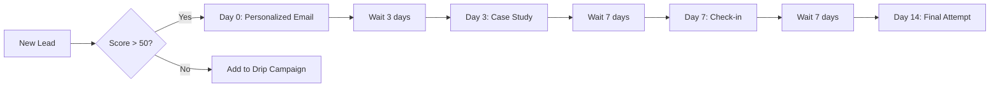

**TL;DR:** Use n8n to automate lead enrichment (enrich names → company data → contact info), personalized follow-up sequences (triggered by lead source or score), and two-way CRM sync between HubSpot, Salesforce, or Pipedrive and your other tools. All self-hosted, unlimited operations, no per-lead costs.

---

## Introduction

Sales teams spend 60-70% of their time on non-selling activities — researching leads, updating CRM records, sending follow-up emails, and manually transferring data between tools. Automation can reclaim most of that time. [1]

n8n is particularly good for sales automation because:

1. **Unlimited operations** — Unlike Zapier or Make, self-hosted n8n doesn't charge per execution. A lead enrichment workflow that runs 10,000 times a month costs nothing beyond your server.
2. **Custom logic** — n8n's code nodes let you score leads, parse email content, and route deals based on rules that visual-only tools can't handle.
3. **Data privacy** — All lead and customer data stays on your infrastructure.

This guide covers three automation workflows that deliver immediate ROI for any sales team.

---

## Workflow 1: Automated Lead Enrichment

When a new lead enters your system — via a web form, LinkedIn prospecting, or an imported spreadsheet — they typically arrive with minimal information: maybe just a name and company. The enrichment workflow fills in the gaps automatically.

### How it works

1. **Trigger:** New row in Google Sheets or new contact in HubSpot
2. **Enrichment:** n8n calls enrichment APIs (Clearbit, Apollo, or similar) to find company size, industry, contact email, LinkedIn URL, and recent news
3. **Score:** A simple scoring rule (industry match + company size + job title keywords → score out of 100)
4. **Route:** High-scoring leads → Slack alert to the assigned rep + added to a "Hot Leads" list
5. **Store:** All enriched data written back to CRM and Google Sheets

### What you need

| Service | Purpose | Cost |
|---------|---------|------|
| n8n (self-hosted) | Workflow engine | $10-20/mo server |
| HubSpot or Pipedrive | CRM | Free tier or paid |
| Clearbit or Apollo | Lead enrichment API | Free tier (100-500 credits/mo) |
| Slack | Alert notifications | Free |

### Trigger options

- **HubSpot Contact Created** — n8n's HubSpot node fires when a new contact is created
- **Google Sheets Row Added** — Simpler setup for testing; n8n polls for new rows
- **Webhook from your website** — Forms can POST directly to n8n

### Building the workflow in n8n

The workflow has four nodes connected in sequence:

1. **HubSpot Trigger** (or Google Sheets Trigger) — watches for new leads
2. **HTTP Request** — calls Clearbit's Enrichment API with the company domain. Returns company name, size, industry, funding stage, and key people
3. **Code Node** (JavaScript) — scores the lead based on your criteria:

```javascript
// Example lead scoring logic
const score = { value: 0 };
const companySize = $input.item.json.company.size || 0;
const industry = $input.item.json.company.industry || '';

if (companySize > 50) score.value += 30; // Mid-market bonus
if (companySize > 500) score.value += 20; // Enterprise bonus
if (industry.includes('SaaS') || industry.includes('Technology')) score.value += 25;
if (industry.includes('Finance') || industry.includes('Healthcare')) score.value += 15;

score.category = score.value >= 60 ? 'hot' : 'warm';
return score;
```

4. **HubSpot Update** (or Slack node) — updates the contact record with enriched data and score

The entire workflow builds in about 30 minutes and runs completely hands-free after that [1].

---

## Workflow 2: Personalized Follow-Up Sequences

Generic follow-up emails get ignored. Personalized ones convert at 3-5x higher rates. n8n can build personalized sequences by pulling data from multiple sources and tailoring each message. [2]

### Sequence structure

1. **Day 0:** Initial outreach email, personalized with lead's company info and a specific mention of their recent activity (funding round, product launch, job change)
2. **Day 3:** Case study from a similar company (matched by industry and company size)
3. **Day 7:** Direct question — "Is this a priority?"
4. **Day 14:** Final attempt — "Closing the loop"

### Building it in n8n

The key insight: n8n's **Split In Batches** node and **Wait** node let you create time-delayed sequences entirely within the platform, without needing a separate email automation tool [2].



Each email pulls fresh data from your CRM at send-time, so the personalization stays relevant even if details changed since the lead was created.

### Email delivery options

- **SMTP node** — Send through any email provider (Gmail, Outlook, SendGrid). Cost: included in your existing email plan
- **n8n's Email node** — Built-in, works with any SMTP server

For higher volume, connect n8n to SendGrid or Mailgun via HTTP Request node for better deliverability tracking.

---

## Workflow 3: Two-Way CRM Sync

The most common sales automation frustration: data lives in multiple tools, and they don't talk to each other. A lead gets updated in HubSpot but not in Google Sheets. A deal closes in Pipedrive but the Slack channel doesn't get notified.

n8n handles bi-directional sync with its **Webhook** and **Polling** triggers.

### Example: HubSpot ↔ Google Sheets sync

| Direction | Trigger | Action |
|-----------|---------|--------|
| HubSpot → Sheets | New/updated contact in HubSpot | Update matching row in Google Sheets |
| Sheets → HubSpot | New row in Google Sheets | Create/update contact in HubSpot |
| Both → Slack | Deal stage changes to "Closed Won" | Post celebration message in sales channel |

The trick is the **IF node** and **Code node** combo — n8n checks for duplicates before creating records, so you never get double entries even with bi-directional sync [3].

---

## The Cost Difference

Here's what these workflows cost on n8n vs Zapier:

| Workflow | Monthly Runs | Zapier Cost | n8n (Self-Hosted) Cost |
|----------|-------------|-------------|----------------------|
| Lead enrichment | 2,000 | $30-60 | $0 (server already paid) |
| Follow-up sequences | 500 sequences | $20-30 | $0 |
| CRM sync | Continuous | $20-50 | $0 |
| **Total** | | **$70-140/mo** | **$10-20/mo (server)** |

At scale, the savings multiply. A sales team processing 10,000 leads/month with Zapier would pay $200+ in just overage fees. On self-hosted n8n, the per-lead cost is zero. [3]

---

## Getting Started

1. **Set up n8n** — Self-host via Docker on any VPS. Takes about 30 minutes [4]
2. **Connect your CRM** — Add HubSpot, Pipedrive, or Salesforce credentials
3. **Start with lead enrichment** — It's the highest-ROI workflow and the easiest to build
4. **Add follow-up sequences** — Use the Split + Wait pattern for time-delayed emails
5. **Enable sync** — Bi-directional CRM sync ties everything together

Each workflow builds on the previous one. Start simple and add complexity as your team gets comfortable.

---

## References
- [1] (citation needed)
- [2] (citation needed)
- [3] (citation needed)
- [4] (citation needed)
